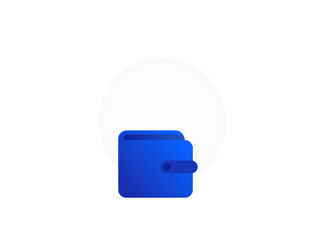

  

# My Wallet

      

## About

    My Wallet is an application for managing your financial life. This project was developed during the full stack bootcamp of Responde Aí.

    <a href="#features">Features</a> •
    <a href="#tech">Tech Stack</a> •
    <a href="#deploy">Deploy</a> •
    <a href="#author">Author</a>

### Features
- [x] Registration and login 
- [x] Initial screen listing all posted entry and exit transactions 
- [x] Current balance display 
- [x] Button for adding a new entry 
- [x] Button for adding new output 
- [ ] Field for the user to specify the date of entry or exit 
- [ ] When clicking on an entry / exit, a screen for editing the entry / exit or deleting it is displayed 
- [ ] Searched period filtering: "All" / "7 days" / "15 days" / "30 days" 
- [ ] Category management for inputs or outputs 
- [ ] Category filtering 

### Tech Stack
Languages: 

The following tools were used in the construction of the project:

The following tools and frameworks were used in the construction of the project: 

  
  
  
  
  
  
  
  
  
  
  
  
  

 
Version Control: 

  
  

### Deploy

The application layout is available on Vercel:

### Author
---

  
    
  Made by 👋🏽 Get in Touch! 
  
  
  

